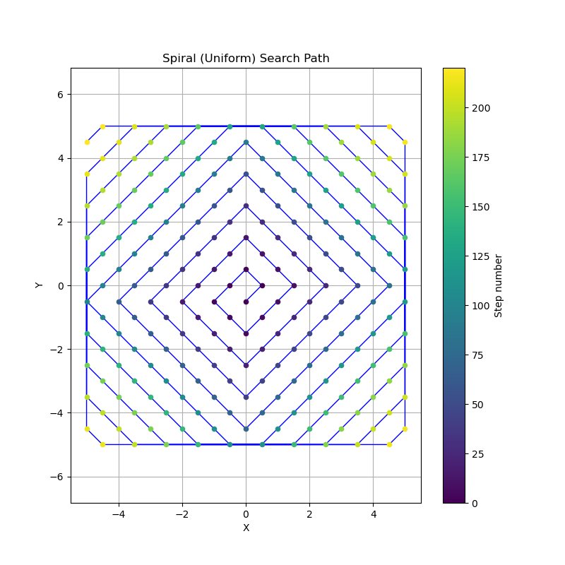
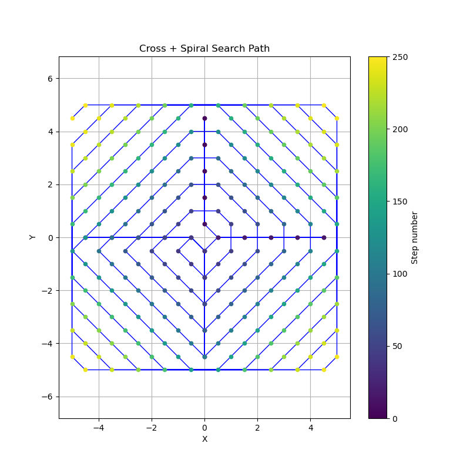

# Grid Search Strategies

Optimal search strategies for finding a car parked on streets, with applications to both regular Manhattan grids and real-world irregular street networks.

## The Core Problem

You are at a restaurant (the origin) and your car is parked somewhere on a street segment within walking distance. You want to minimize expected walking distance to find it. The optimal strategy depends on the street grid topology.

**Key insight**: On perfect grids, geometric patterns work well. In real cities with irregular streets, you must respect actual distances.

---

## Part 1: Regular Manhattan Grid

### Problem Setup

In a perfect Manhattan grid:
- Streets form a regular square pattern (parallel horizontal and vertical streets)
- All blocks have uniform length
- Your search radius is an n-block Manhattan distance (a square)

### Strategies on Regular Grids

1. **Spiral (Expanding Square)**: Expanding square spiral, visiting all segments within distance k before k+1. Optimal principle: search closer locations first.
   

2. **Cross + Spiral**: 4-armed cross with backtracking (walking out and back on each arm) then spiral the remaining segments. Includes return trips, leading to double-backing near the origin.
   

3. **Random**: True random walk that can revisit segments. Inefficient due to revisits (expected hitting time is O(n²) with large constant).
   

4. **East Biased Spiral**: Spiral biased towards positive x (east) direction. Useful if you remember the direction you walked.
   

5. **Long Skinny Spiral**: Spiral optimized for elongated blocks, prioritizing horizontal movement within each distance ring.
   

6. **Residential Street**: Only searches segments not on main streets (axes), assuming car is on residential streets. Efficient if prior is concentrated on residential areas.
   

### Results on Regular Grids

For n=5 (220 street segments, 10,000 Monte Carlo trials):

| Strategy | Expected Distance | Notes |
|----------|------------------|-------|
| Spiral | 111.14 | Baseline systematic search |
| Long Skinny Spiral | 109.88 | Optimizes for block geometry |
| Residential Street | 100.37 | Efficient if car is on residential streets |
| East Biased Spiral | 119.29 | Worse under uniform prior |
| Cross + Spiral | 139.02 | Inefficient: re-walks streets near origin |
| Random | 411.02 | Very inefficient: revisits cause waste |

**Key observation**: Under uniform prior, all complete systematic searches have the same expected distance (111). Efficiency comes from:
- Correct priors (residential streets, biased direction)
- Avoiding re-walks (spiral beats cross+spiral)

### Running Regular Grid Simulation

```bash
python spiral_search.py
```

---

## Part 2: Irregular Grids (Real-World Streets)

### Why Regular Strategies Fail

Real cities have:
- Non-parallel streets
- Non-uniform blocks
- Dead-ends
- Diagonal shortcuts
- Unpredictable geometry

**The core problem**: Concepts like "n-blocks away" become meaningless. Your search radius isn't a square—it's a blob following actual street distances.

**What breaks**:
1. **Distance is ambiguous**: Is it Euclidean? Walking distance? Number of segments?
2. **Spirals don't close cleanly**: The spiral breaks down, forcing re-walks
3. **Geometric heuristics fail**: Cross patterns, ring patterns all misalign with real street distances

### Solution: Dijkstra-Order Search

**Algorithm**: Visit street segments in order of their **true walking distance** from the restaurant.

1. Use Dijkstra's algorithm to compute walking distances from the restaurant to all street intersections.
2. Assign each street segment a priority = the distance to its nearest intersection.
3. Visit segments in increasing order of distance.
4. This guarantees closer streets are searched first by actual walking distance.

**Why it's optimal**:
- Respects the actual street network topology
- Guarantees nearest-first search by true distance
- Avoids re-walking streets (monotonic distance increase)
- Adapts to any street pattern (dead-ends, diagonals, etc.)

### Results on Irregular Grids

For an 8×8 irregular grid with ~119 street segments:

| Strategy | Expected Distance | Notes |
|----------|------------------|-------|
| **Dijkstra-Order** | 60.09 | Optimal: searches by true distance |
| Spiral-Like | 61.56 | Includes re-walks due to irregular geometry |
| **Improvement** | +2.4% | Dijkstra is more efficient |

The spiral-like search tries to mimic regular grid spirals by using Euclidean rings, but on irregular grids this causes:
- Misalignment with actual street distances
- Unexpected dead-ends forcing backtracking
- Irregular geometry breaking the spiral pattern
- Result: re-walks and wasted distance

### Visualizations

**Dijkstra-Order Search**: Colors show segments ordered by true walking distance. The path expands smoothly outward, respecting the actual street network.

**Spiral-Like Search**: The path tries to spiral but includes re-walks (backtracking) where the regular grid pattern breaks down.

### Running Irregular Grid Simulation

```bash
python irregular_grid.py
```

---

## Implementation

### Simulation Method (Monte Carlo)

Both simulations use the same approach:
1. Generate a search path (order of segments to visit)
2. For each trial (1,000–10,000):
   - Randomly place the car on a segment
   - Walk the search path until the car is found
   - Record the walking distance
3. Average across all trials

### Metrics

- **Expected Walking Distance**: Average segments walked until car is found
- **Uniform Prior**: Car equally likely on any segment
- **Biased Prior**: Car more likely on certain types of streets (residential, main streets, directions)

### Code Files

- `spiral_search.py`: Regular grid simulation with 6 strategies
- `irregular_grid.py`: Irregular grid with Dijkstra vs. spiral comparison

---

## Key Takeaways

1. **On regular grids**: Spirals are optimal by principle (nearest-first search), but only provide advantage under non-uniform priors. Under uniform prior, all complete searches are equivalent.

2. **On irregular grids**: Geometric patterns (spirals, crosses) break down. Search by distance, not by geometry.

3. **In practice**: Real-world navigation (Google Maps, delivery services) uses distance-based ordering (Dijkstra-like) rather than geometric spirals because cities are irregular.

4. **The principle**: When you don't know where the target is, search closer locations first. The definition of "closer" matters—it should use actual distances in the real topology.