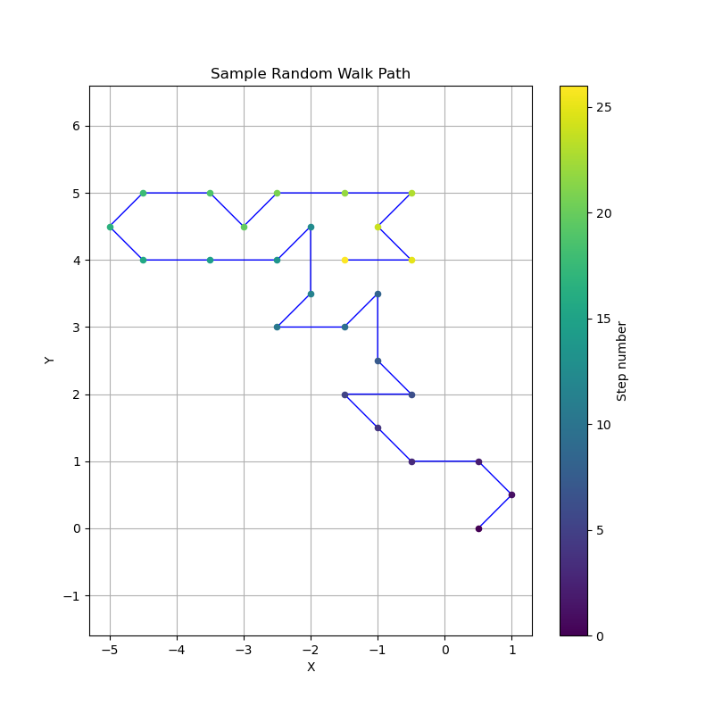

# Spiral Search Simulation

## Problem Statement

You are at a restaurant (the origin) and your car is parked on some street segment within an n-block Manhattan distance. You want to minimize the expected walking distance to find it. This program simulates different search strategies and compares their performance via Monte Carlo simulation.

## Strategies

1. **Spiral (Uniform)**: Expanding square spiral, visiting all segments within distance k before k+1. Optimal under uniform prior as it searches closer locations first.
   

2. **Cross + Spiral**: 4-armed cross with backtracking (walking out and back on each arm) then spiral the remaining segments. Includes return trips, leading to double-backing near the origin, which increases walking distance.
   

3. **Random**: True random walk that can revisit segments, starting from the east segment from the origin and moving randomly to adjacent segments until finding the car. Inefficient due to revisits, leading to higher expected distance.
   

4. **East Biased Spiral**: Spiral biased towards positive x (east) direction. Useful if you remember walking east after parking.
   

5. **Long Skinny Spiral**: Spiral optimized for long horizontal blocks, prioritizing horizontal movement within each distance ring.
   

6. **Residential Street**: Only searches segments not on the main streets (axes), assuming car is on residential streets. Efficient if the car is indeed on residential streets.
   

## Metrics

The program uses Monte Carlo simulation with 10,000 trials to estimate expected walking distance. For each trial:
- A car position (street segment) is randomly sampled according to the prior weights.
- For systematic strategies, the fixed search path (order of segments to walk) is followed.
- For random walk, a new random path is generated per trial, allowing revisits.
- The car is "found" when you walk the segment containing the car.
- The walking distance is the cumulative length of segments walked up to and including the one with the car (each segment has length 1).
- Results are averaged over all trials.

## Results

For n=5 (220 street segments, Monte Carlo simulation with 10,000 trials):

- Spiral (Uniform): 111.14
- Cross + Spiral: 139.02
- Random: 411.02
- East Biased Spiral: 119.29
- Long Skinny Spiral: 109.88
- Residential Street: 100.37

## Running

```bash
python spiral_search.py
```