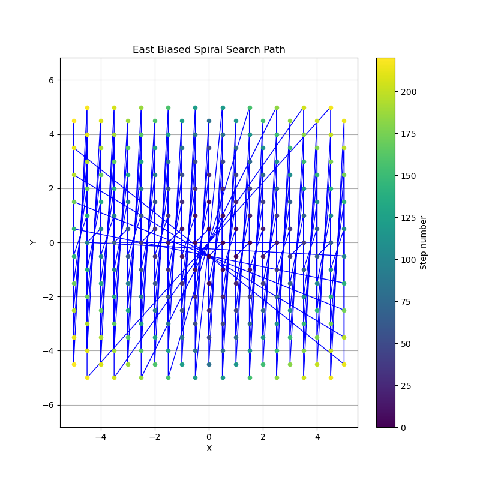
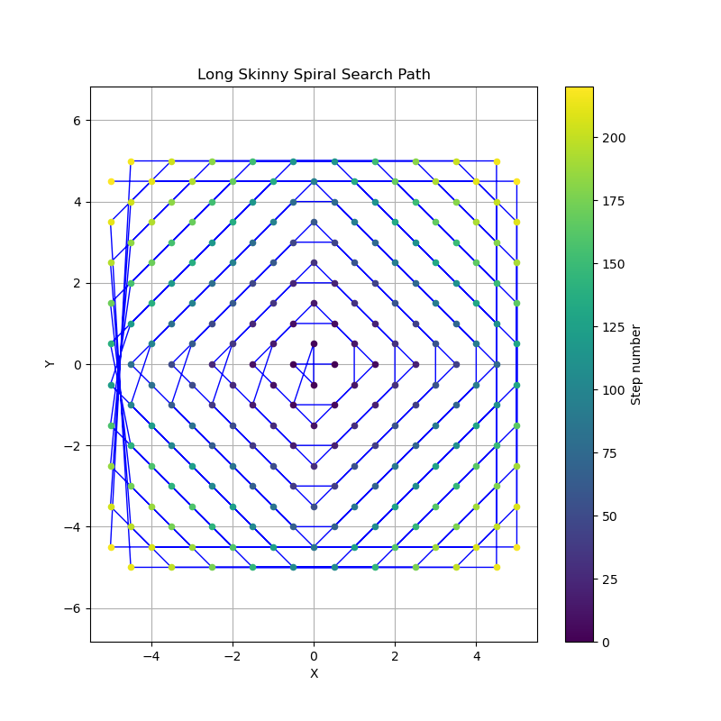
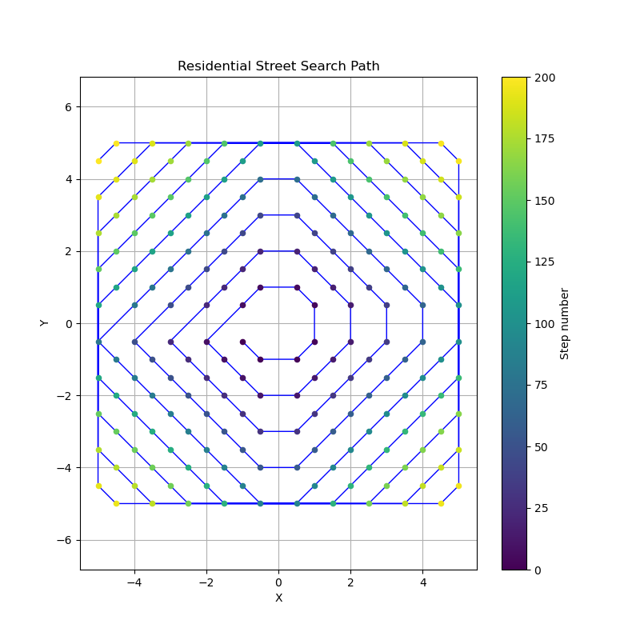

# Spiral Search Simulation

This program simulates different search strategies for finding a car parked on a street segment within an n-block Manhattan distance radius from the restaurant (origin). The car's location is sampled on street segments (midpoints of blocks) rather than at grid intersections.

## Strategies

1. **Spiral (Uniform)**: Expanding square spiral, visiting all segments within distance k before k+1. Does not double-back.
   

2. **Cross + Spiral**: 4-armed cross with backtracking (walking out and back on each arm) then spiral the remaining segments. Includes return trips, leading to double-backing near the origin.
   

3. **Random**: True random walk that can revisit segments, starting from the east segment from the origin and moving randomly to adjacent segments until finding the car.
   (No visualization as path varies per trial)

4. **East Biased Spiral**: Spiral biased towards positive x (east) direction.
   

5. **Long Skinny Spiral**: Spiral optimized for long horizontal blocks, prioritizing horizontal movement.
   

6. **Residential Street**: Only searches segments not on the main streets (axes), assuming car is on residential streets.
   

## Metrics

The program uses Monte Carlo simulation with 10,000 trials to estimate expected walking distance. For each trial:
- A car position (street segment) is randomly sampled according to the prior weights.
- For systematic strategies, the fixed search path (order of segments to walk) is followed.
- For random walk, a new random path is generated per trial, allowing revisits.
- The car is "found" when you walk the segment containing the car.
- The walking distance is the cumulative length of segments walked up to and including the one with the car (each segment has length 1).
- Results are averaged over all trials.

- **Uniform Prior**: Assumes car is equally likely on any segment.
- **East Bias Prior**: Segments with higher x (east) are more likely (weight = 1 + max(0, x)).
- For Residential Street, assumes car is on residential street segments (not on axes).

**Cross + Spiral Inefficiency**: The cross strategy includes return trips, meaning you walk back over segments you've already checked. This is visible in the path visualization as dense lines near the origin. While this may feel intuitive in practice, it increases the total walking distance compared to a pure spiral.

**Random Walk vs Systematic**: The random walk can revisit segments, leading to much higher expected distance (O(n^2 log n) for coverage, but here for hitting a specific point it's still O(n^2) but with higher constant due to revisits). Systematic strategies are more efficient.

## Output

- Expected walking distance for each strategy under its appropriate prior.
- Visualization plots saved as PNG files showing the walking path (connected midpoints colored by step order). Random walk is not visualized as it varies per trial.

## Running

```bash
python spiral_search.py
```

## Results

For n=5 (220 street segments, Monte Carlo simulation with 10,000 trials):

- Spiral (Uniform): 111.14
- Cross + Spiral: 139.02
- Random: 411.02
- East Biased Spiral: 119.29
- Long Skinny Spiral: 109.88
- Residential Street: 100.37

The spiral performs similarly to random under uniform prior (as expected mathematically). The cross + spiral is less efficient due to backtracking. Residential street search is efficient if the car is on residential streets. The east biased spiral has higher expected distance due to the mismatch between path ordering and prior weighting.